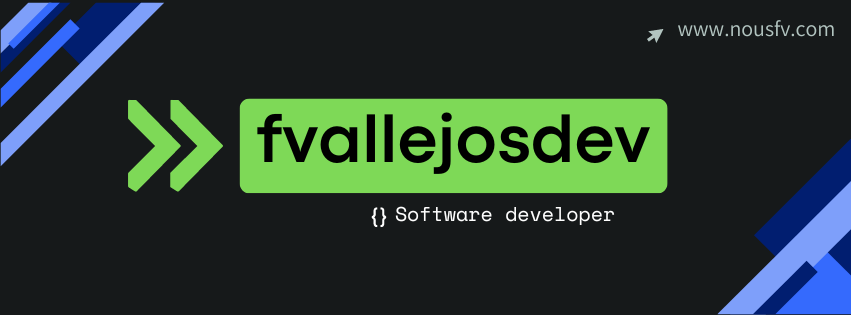

# Hola, mi nombre es Fernando Vallejos 
### Freelance full-stack .Net & Angular

Soy desarrollador de software full stack con 3 años de experiencia. Actualmente, me especializo construir aplicaciones empresariales utilizando .NET, Java, Angular, Blazor . Disfruto enfrentando desafíos y poseo la capacidad de transformar conceptos iniciales en soluciones concretas, implementadas y verificadas.

<!--tech stack icons-->

  

<!--
**fvallejosdev/fvallejosdev** is a ✨ _special_ ✨ repository because its `README.md` (this file) appears on your GitHub profile.

Here are some ideas to get you started:

- 🔭 I’m currently working on ...
- 🌱 I’m currently learning ...
- 👯 I’m looking to collaborate on ...
- 🤔 I’m looking for help with ...
- 💬 Ask me about ...
- 📫 How to reach me: ...
- 😄 Pronouns: ...
- ⚡ Fun fact: ...
-->
